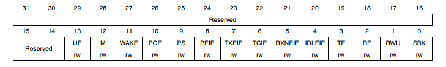

# Python Mask Generator
Python Scripts to Generate #defines Masks of the Registers bits of any Register in any Micro-Controller

## One Bit MASK Generator:

Give you the #define of the setting mask and clearing mask of single bits with different name of a whole Register

  

### The steps to use the Generator 
 1. Enter the name of the Register
 2. Enter the names of the required Bits needed up to 32 bits

a header file will be generated with #defines. 

  

## Multiple_Bits_Mask

Give you the #define of the setting mask and clearing mask of one Mask with multipe bits

### The steps to use the Generator 
 1. Enter the name of the Register
 2. Enter the name of the Mask
 3. Enter the number of the bits of the Mask
 4. enter the positions of the bits of the mask
 
 a header file will be generated with #defines. 
